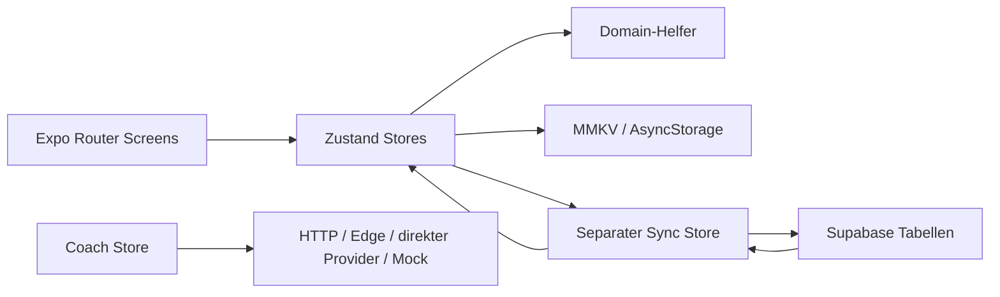
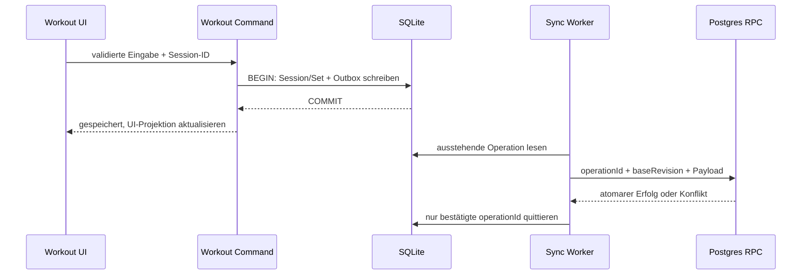

# Fitness Tracker – Audit und Zielarchitektur

Stand: 10. September 2026. Referenz: `knrds/fitness-tracker`, Commit `570383a5b93feefa18632ec0623de93a797f16d4` vom 24. Juni 2026. Sprache des Berichts: Deutsch.

## 1. Executive Summary

**Empfehlung: React Native + Expo beibehalten und einen kontrollierten Hybrid-Rebuild durchführen.** Vorhandene Produktfunktionen und das Volt-Design bleiben Referenz. Workout-Persistenz, Benutzerisolation, Sync und Auth benötigen wesentlich stärkere Grenzen und Fehlerbehandlung. Flutter oder React Native Bare lösen diese konkreten Datenprobleme nicht und würden die funktionierende Oberfläche sowie 136 bestehende Tests entwerten.

Der Referenzstand installiert, kompiliert und besteht sämtliche vorhandenen Tests. Trotzdem wurde im Browser ein kritischer Fehler reproduziert: Der erste Start eines leeren Workouts führt zu „No active workout“, weil der Startup-Checker die gerade erzeugte Session zurücksetzt. Weitere durch Code belegte Risiken betreffen automatische Session-Löschung, Sync-Verlust, Kontentrennung und öffentlich auslieferbare LLM-Schlüssel.

**Kein Release-fähiger Zustand.** Grüne Tests sind ein brauchbares Fundament, aber kein Beleg für Recovery, native Gerätefunktion, SQL-RLS oder Netzwerkfehler. Die Testdatei für Recovery verlangt sogar ausdrücklich das Löschen alter Sessions – damit testet sie ein Verhalten, das dem neuen Produktziel widerspricht.

### Untersuchungsgrenzen

Repository vollständig inventarisiert: 175 versionierte Dateien, einschließlich versteckter Konfiguration, API, Assets, Agent-Dateien, Dokumentation, Tests und Git-Historie. Vertiefte Codeprüfung insbesondere aller Stores, Domain-Helfer, Schemas, Auth/Sync/Coach-Grenzen und relevanter Screen-Flows. Kein Anspruch auf mathematische Fehlerfreiheit oder vollständige Ausführung jedes UI-Zweigs.

Browserprüfung: Chromium, 390 × 844 CSS-Pixel, lokale Web-Vorschau ohne echte Zugangsdaten. Workout-Eingabe, Abschluss, History und Persistenz nach erneuter Navigation zum App-Einstieg tatsächlich ausgeführt. Weitere Screens teilweise visuell, teilweise statisch rekonstruiert. Keine Live-Backend-, iOS-, Android-, HealthKit-, GPS- oder Store-Abnahme. Expo-Konto und iPhone sind laut Benutzer vorhanden; Apple-Developer-Mitgliedschaft noch nicht.

## 2. Current Product

Volt Performance ist vor allem ein Krafttrainings-Logger. Das Produkt verbindet Übungen, Templates, mehrwöchige Programme, aktive Sessions, Verlauf, Körperwerte und Gamification. Zusätzlich vorhanden: Wasserzähler, Koffeinzähler und Coach-Chat mit mehreren Fallback-Pfaden. Social, Marketplace, Lauftracking und Ernährung stehen in Roadmaps, besitzen aber keine entsprechende fertige Implementierung.

Fünf sichtbare Haupttabs: History, Plans, Home, Coach, Body. Übungen sind zusätzlich in Body eingebettet; die eigenständigen Exercise- und Program-Routen sind in der Tab-Leiste versteckt. Die Oberfläche mischt Deutsch und Englisch. Das ist kein vollständig lokalisiertes Produkt.

Der exemplarische Browser-Flow nach erneutem Start: Quick Workout → Barbell Curl → 20 kg × 10 → Set abhaken → Finish → Template ablehnen → Abschluss mit 200 kg Volumen und einem Set → Home → App-Einstieg erneut laden → History enthält die Session. Angezeigtes e1RM: 23,3 kg, entsprechend der vorhandenen Curl-Heuristik; nicht klassisches Epley.

## 3. Feature Matrix

Status gilt für den Referenzcode, nicht automatisch für native Produktionsreife. ✅ = lokal implementiert und durch Code/Test plausibilisiert; 🟡 = teilweise; 🔴 = konkreter Defekt; ⚪ = UI/Mock; 🔵 = geplant; ❓ = extern ungeprüft. Speicher „KV“ bedeutet gemeinsamer MMKV/AsyncStorage-Adapter.

| Feature | Status | Screen | Business Logic | Persistenz | Backend | Tests | Probleme |
|---|---|---|---|---|---|---|---|
| Leeres Workout starten | 🔴 | Home, Plans, session | workoutStore | KV | erst Abschluss | Store, kein Root-Flow | erster Start wird vom Startup-Checker gelöscht |
| Sets, Gewicht, Reps | ✅ | session | workoutStore | KV | verschachtelter Sync | Store | keine konsequente Action-Validation |
| RPE/RIR | 🟡 | session, profile | Set-Inputs, e1RM | KV | Set-Spalten | teilweise | Template-Start übernimmt nicht alle Ziele |
| Set-Typen | ✅ | session | warmup/working/drop/failure/amrap/backoff | KV | enum | Domain/Store | UI-Auswahlumfang je Oberfläche prüfen |
| Warmup-Rechner | ✅ | SessionExerciseCard | 50/70/90 %, 10/5/2 | KV | indirekt | Store | ersetzt bestehende Warmups, auch abgeschlossene |
| Supersets | 🟡 | session | Gruppen-ID | KV | Spalte | Store | History-Wiederholung verliert Gruppierung |
| Timer/Minimierung | 🟡 | session, Tabs | Zeitstempel/Rest-Ende | KV | Dauer | RestTimer | keine Hintergrund-Benachrichtigung |
| Workout Recovery | 🔴 | Root-Modal | resumeWorkoutGuard | KV | nein | falsche Löschanforderung getestet | >12 h oder keine abgeschlossenen Sets: löschen |
| Workout-Abschluss | 🟡 | session/Modals | Guard, History, XP | mehrere KV-Writes | Queue | Store/Modal | kein atomarer Commit über Stores |
| Exercise Library | ✅ | Body/Exercises | Filter, Taxonomie, Favoriten | eingebettet + KV | Custom-Sync | Store/Komponenten | Bilder benötigen externe Quelle |
| Eigene Übungen | 🟡 | CustomExerciseModal | UUID, Owner | KV | INSERT | Store/Modal | Cloud-Pull aktualisiert abgeleitete Listen nicht |
| Übungsnotizen/Rest-Defaults | ✅ | exercise/session | exerciseStore | KV | nicht vollständig | teilweise | lokale Zusatzdaten fehlen im Cloudmodell |
| History/Details/Wiederholen | 🟡 | history, history/[id] | Summaries, Sortierung | KV | Sessions | Store/Domain | Wiederholung verliert RIR, Dauer, Distanz, Supersets |
| Volumen | ✅ | History, Profil, Summary | Summe Gewicht × Reps ohne Warmups | abgeleitet | indirekt | Domain | kg-lastbasiert, kein Gesamtlastmodell für Körpergewicht |
| PRs/e1RM | 🟡 | Progress, Session, XP | mehrere Definitionen | abgeleitet | PR-Tabelle kaum angebunden | Domain | maxWeight vs e1RM; Namens-Heuristik |
| Progress-Charts | 🟡 | History/Progress | Verlauf/Prozentwerte | abgeleitet | indirekt | Domain | gleiche Übung mehrfach: nur erster Eintrag |
| Templates | 🟡 | Plans, template-builder, quick-start | programStore | KV | Parent/Children | Store | Ziel-RIR/Rest/Gruppen nicht komplett gestartet |
| Programme/Builder | 🟡 | Plans/Programs, builder | Wochen/Tag-Zuordnung | KV | Parent/Children | Store | globale Default-IDs kollidieren zwischen Konten |
| Körpergewicht/Fett/Umfänge | ✅ | Body | metrische Normalisierung | KV | body_metrics | Store | manche Date-/Input-Grenzen nur UI-seitig |
| Ruhepuls | 🟡 | Modell/Store | positives Integer | KV | Spalte | Schema | nicht durchgängig als Eingabe angeboten |
| Wasser | ✅ | Body | Tageskey, Ziel, Add/Remove | KV | nein | Store | Tageswechsel im offenen Screen nicht belegt |
| Koffein | ✅ | session | Presets, aktuelles/letztes Workout | KV | nein | Store | keine vollständige historische Entität |
| Streak | 🔴 | Home, History, Profile | lokale Keys + UTC-Reparse | abgeleitet | nein | Domain | westliche Zeitzonen falsch |
| XP/Achievements | 🟡 | History/Modal/Home | Basis + Volumen + PR + Rewards | KV | nein | Store | PR-Anzahl = Übungen mit Bestgewicht; keine Idempotenz |
| Profil/Einheiten | 🟡 | profile | kg/cm intern | KV | nur Teilmodell | Store | updateProfile erzeugt keinen Sync |
| Avatar | 🟡 | profile | ImagePicker | lokale URI | kein Upload | kein Gerätebeleg | URI-Lebensdauer, Gerätewechsel |
| Login/Registrierung | 🟡 | auth/* | Supabase Auth | KV/AsyncStorage | vorgesehen | gemockt | Isolation und echte Session ungeprüft |
| Passwortreset/Verifikation | 🔴 | auth/*, Root | E-Mail-Calls | Auth | Supabase | gemockt | kein Callback-Tokenaustausch, Root-Redirect kollidiert |
| Cloud Sync | 🔴 | SyncIndicator | FIFO, Mapping, Pull | KV-Queue | SQL vorhanden | Mapping, keine Transaktionen | Queue-Rennen, NULLs, verlorene Deletes |
| Coach Chat | 🟡/⚪ | Coach | Kontext + HTTP + simuliertes Streaming | KV | Vercel/OpenRouter oder Edge | gemockt | Key im Client möglich, Endpoint ohne Auth, Mock unklar |
| Export | 🟡 | profile | JSON | Ausgabe | nein | kaum | Templates, Programme, aktive Session, weitere Daten fehlen |
| Alle Daten löschen | 🔴 | profile | Store-Reset | KV | kein Server-Delete | teilweise | Coach/Queue/Auth bleiben, Cloud kann Daten zurückbringen |
| Dark Mode | ✅ | alle | feste Tokens | nein | nein | UI-Basis | nur Dark; Systemeinstellung ändert Palette nicht |
| Onboarding/Theme-Wechsel | 🔵 | Roadmap | fehlt | fehlt | fehlt | fehlt | kein fertiger Flow |
| Social/Community/Challenges/Leaderboard | 🔵 | Roadmap | fehlt | fehlt | fehlt | fehlt | keine fertigen Features |
| Marketplace/Payments | 🔵 | Roadmap | fehlt | fehlt | fehlt | fehlt | nicht für Kernrelease erforderlich |
| Running/GPS | 🔵 | Roadmap | fehlt | fehlt | fehlt | fehlt | keine Location-Bibliothek/Permissions |
| Nutrition/Barcode | 🔵 | Roadmap | fehlt | fehlt | fehlt | fehlt | Wasser/Koffein sind kein Ernährungstracker |
| HealthKit/Health Connect/Widgets | 🔵 | Ziel | fehlt | fehlt | fehlt | fehlt | native Integrationen später |

## 4. Screen & Navigation Map

| Route / Screen | Zweck und Einstieg | Aktionen / Daten / Komponenten | Folge / Zustände |
|---|---|---|---|
| `(tabs)/index` | Dashboard, App-Einstieg | Profil, Streak, XP, freie Session, gespeicherte Templates, Muskel-Heatmap | profile, session, programs, Body-Filter; ohne aktives Programm eigene Card |
| `(tabs)/workouts` | Plans-Tab | Templates und eingebettete Programme, Reihenfolge, Start, Edit/Delete | template-builder, builder, session; vorinstallierte Routinen |
| `(tabs)/programs` | Programmkatalog, versteckter Tab | aktive Routine, Wochen/Tag-Kalender, Aktivieren, Bearbeiten | builder, Template, Session |
| `(tabs)/history` | Activity | History/Progress/Achievements, Kalender, Session-Cards, Charts, Filter | Detail-Sheets, history/[id]; leer, ein Datenpunkt, mehrere Punkte |
| `(tabs)/body` | Körperwerte + Übungen | Metrics/Exercises, Gewicht/Fett/Umfänge, Wasser, Verlauf | Eingabe-Modal, Exercise-Detail; Charts ab zwei Punkten |
| `(tabs)/exercises` | Übungsbibliothek | Suche, Muskel/Equipment, Favoriten, eigene Übung, ExerciseRow/Card | exercise/[id], CustomExerciseModal; Ergebnisleerstand |
| `(tabs)/coach` | Chat | Nachrichten, Schnellfragen, Profil/letzte Workouts, Clear | Sending/Error/Offline/Fallback; keine native Modellinferenz |
| `profile` | Einstellungen | Name, Körper/Max-Werte, Einheiten, Bild, RPE/RIR, Export/Reset/Auth | ImagePicker, Dialoge, Login; lokale Änderungen |
| `exercise/[id]` | Übungswissen | Bild/Fullscreen, Instruktionen, Muskeln, Restdauer | zurück, Trainingsbezug; Missing-ID/kein Bild |
| `history/[id]` | Session-Detail | Sets, Summary, Wiederholen, Löschen | session oder history; Missing-ID |
| `workout/quick-start` | Template-Auswahl | Templates und Start | session; leerer Katalog |
| `workout/session` | laufendes Training | SessionExerciseCard, Picker, Notes, RestTimer, PlateCalculator, Warmups, Koffein, Reorder | minimieren, abbrechen, Template-Frage, Abschlussmodal |
| `programs/template-builder` | Template-Editor | Name/Beschreibung, Übungen, Sets/Reps/Last/RPE, Drag/Buttons | Plans, Save/Cancel, Eingabefehler |
| `programs/builder` | Programm-Editor | Wochen, Ziel, Tage, Templates, Reihenfolge | Plans; fehlender Name/Templates |
| `auth/login` | Zugang | E-Mail/Passwort, Loading/Error | register, forgot-password, Home |
| `auth/register` | Konto | Name/E-Mail/Passwort | verify oder Home |
| `auth/verify` | E-Mail bestätigen | Resend, Status/Info | Login; externe E-Mail-Konfiguration nötig |
| `auth/forgot-password` | Reset anfordern | E-Mail, Rückmeldung | externer Link |
| `auth/reset-password` | Passwort setzen | Passwort + Wiederholung | Home; Recovery-Session-Verarbeitung fehlt |

Globale Schichten: ThemeProvider, DialogProvider, GestureHandlerRootView, SafeAreaProvider, Fonts/Splash, StatusBar, AchievementCelebration, WorkoutCompleteModal, StartupWorkoutChecker, KeyboardDoneAccessory. `+html.tsx` ist Web-Dokument, kein Produktscreen.

Visuelle Evidenz: `audit-home.png`, `audit-history.png`, `audit-progress.png`, `audit-plans.png`, `audit-programs.png` und weitere beigefügte Screenshots. Design_idea-Dateien sind historische Entwürfe und kein Laufzeitbeleg.

## 5. Current Architecture

pnpm-Monorepo mit drei Workspaces. `apps/mobile` ist Expo-App; `packages/domain` enthält reine TS-Modelle, Zod, Katalog und Rechenfunktionen; `packages/ui` ist inzwischen eine echte Komponentenbibliothek. `api/coach-chat.js` ist eine separate CommonJS-HTTP-Funktion ohne eigenen Paket-/Test-/Deploy-Vertrag. Kein echtes Backend-Migrationsprojekt.



Positiv: Domain-Paket ohne React, striktes TS, gemeinsame UUIDs und kg/cm-Konventionen, wiederverwendbare UI-Primitives. Problematisch: Stores importieren einander zyklisch; dynamische Imports kaschieren nur einen Teil davon. Persistenz und Netzwerksideeffects werden innerhalb von State-Updatern ausgelöst. Große Screen-Dateien enthalten Berechnungen und Orchestrierung. Es fehlt eine klare Transaktionsgrenze für „Workout abgeschlossen“.

## 6. Current Tech Stack und Dependencies

Tatsächlich: Expo 54.0.35; React Native 0.81.5; React 19.1; Router 6.0.24; TypeScript root/mobile 5.9.3, Domain 5.3.x; Zustand 5; Zod 3; MMKV 3; AsyncStorage 2.2; Supabase JS 2; Vitest 4.1.7 und Jest 29/jest-expo 54. pnpm 11.5.0 ist gepinnt. Audit lief unter Node 24.13.0; CI unter Node 22.

| Dependency/Gruppe | Entscheidung | Begründung |
|---|---|---|
| Expo/RN/React/Router | UPDATE gemeinsam | Fundament passend; SDK-Migration separat mit nativer Abnahme |
| TypeScript | KEEP/vereinheitlichen | strikte Grenzen sinnvoll; ein Toolchainstand |
| Zustand | KEEP | kleiner UI-/Session-Projektionsstate, nicht langfristig gesamte Datenbank |
| Zod | KEEP | Eingangsgrenzen; major upgrade ohne unmittelbaren Nutzen vertagen |
| MMKV | KEEP begrenzt | Einstellungen/Legacy-Import; transaktionale Workouts nach SQLite |
| AsyncStorage | KEEP nur Legacy/Fallback | asynchrone Hydration explizit abwarten; keine neue zweite Workout-Wahrheit |
| Supabase JS | KEEP/UPDATE | Auth/Postgres passen; Verträge und RLS tatsächlich testen |
| TanStack Query | vorerst nicht hinzufügen | lokale Workout-Daten aus SQLite; später echte Server-Queries |
| expo-dev-client | ADD | professioneller Geräteworkflow statt Expo-Go-Abhängigkeit |
| expo-sqlite | ADD beim Persistenzschnitt | lokale Transaktionen und Outbox zusammen |
| expo-secure-store | ADD für Tokens | OS-geschützter Schlüsselspeicher, definierte Token-Migration |
| expo-av | REPLACE/REMOVE | offiziell deprecated; Audio/Video getrennte Nachfolger [S4] |
| expo-haptics, crypto, font, image, image-picker | KEEP | tatsächliche Plattformfunktionen; SDK-kompatibel pinnen |
| gesture-handler, reanimated, worklets, screens, safe-area | KEEP/UPDATE zusammen | native UX; Worklets/Babel-Kompatibilität prüfen |
| react-native-svg/chart-kit | KEEP zunächst | funktionierende Charts; Austausch erst bei messbarem Bedarf |
| hook-form/resolvers | Nutzung prüfen, sonst REMOVE | keine zusätzliche Form-Lösung nur wegen Installation |
| @opentelemetry/api | Nutzung prüfen, sonst REMOVE | keine belegte Observability-Pipeline |
| manrope/space-grotesk/vector-icons | KEEP | prägen Produktidentität, lokal bündeln |
| react-dom/react-native-web/metro-runtime | optional KEEP | Entwicklungs-/Auditpreview; kein primäres Releaseziel |
| zahlreiche Metro-root-Pins, hermes-parser | REPLACE durch SDK-Defaults, nach Verifikation | historische Reparaturlast; nicht blind entfernen |
| Jest/RNTL/Vitest | KEEP/UPDATE passend | vorhandene Tests nutzen, zusätzliche Fehlerszenarien |
| ESLint 8 | UPDATE separat | Config-Migration; Hook-/Accessibility-Regeln ergänzen |

`expo install --check` verlangt 54.0.37, constants 18.0.14 und jest-expo 54.0.18 für die bestehende SDK-Linie. Wrapper setzen `EXPO_NO_DEPENDENCY_VALIDATION=1`; das verdeckt diese Hinweise im Alltag. Der gewählte Ziel-SDK muss beim tatsächlichen Upgrade anhand der offiziellen Versionstabelle festgelegt werden, nicht anhand alter Agent-Dateien. SDK 56-Dokumentation ist verfügbar; SDK 54 ist hier lediglich geprüfte Ausgangsbasis.

`pnpm audit`: 71 Meldungen (1 critical, 48 high, 20 moderate, 2 low), über Entwicklungs- und Laufzeitabhängigkeiten. Keine Gleichsetzung mit 71 ausnutzbaren App-Lücken. Critical-Meldung betrifft `tar`, GHSA-23hp-3jrh-7fpw, <=7.5.18; Patch >=7.5.19. Vollständige JSON-Evidenz separat. Kein pauschales `audit fix --force`.

## 7. Data Architecture und Business Logic

### Modelle und Persistenz

User → WorkoutTemplate → TemplateExercise → Exercise; User → Program → ProgramWorkout → Template; User → WorkoutSession → SessionExercise → ExerciseSet. Ergänzend PersonalRecord und BodyMetric/BodyMeasurements. UUIDs mit Expo Crypto; Bibliotheks-IDs deterministisch aus externem Katalog. Lokaler Benutzer ist feste UUID. `ActiveWorkoutState`, RestTimer und ChatMessage existieren zusätzlich. Types und Zod werden parallel gepflegt; nicht alle Grenzen sind deckungsgleich.

Elf SQL-Tabellen besitzen RLS-Definitionen, Top-Level über `auth.uid()`, Kinder über Parent-Existenz. **„RLS fehlt“ wäre falsch.** Es fehlen jedoch ausgeführte Mehrbenutzer-Tests, Migrationshistorie, Seed für den Übungskatalog und ein atomarer Sync-Vertrag. FK-Prüfungen ersetzen keine Sichtbarkeitsprüfung referenzierter fremder Übungen/Templates. Installation des SQL-Schemas in einem realen Supabase-Projekt wurde nicht belegt.

Persistierte Stores: Workout, History, Exercise, Program, Profile, BodyMetric, Achievement, Hydration, Caffeine, Coach und Sync. Auth hat separaten Supabase-Storage. Keine Namespaces pro Benutzer. Datumswerte werden mittels generischem Regex-Reviver restauriert. Zod prüft den Snapshot, verwendet bei Erfolg aber nicht `validation.data`; bei Fehler werden die Datenfelder pauschal zurückgesetzt. Ein ungültiger Datensatz kann damit eine ganze History leeren.

### Rechenverträge

| Logik | Input → Berechnung → Output | Edge Cases / Testlage |
|---|---|---|
| Volumen | fertige Sets → Σ kg × Reps, Warmups standardmäßig aus → kg-Wiederholungen | Null/0-Last, unvollständige Sets; Domain-Tests vorhanden |
| Summary | Session → Dauer + fertige Setzahl + Arbeitsvolumen | Setzahl enthält Warmups, Volumen nicht; UI muss das benennen |
| e1RM | Gewicht, Reps, RIR/RPE, Übungsname → effektive Reps; Divisor 30/45/50/60 → Schätzwert | RIR vor RPE; Name steuert Formel; keine gesicherte wissenschaftliche Kalibrierung im Repo |
| PR-Erkennung | Session vs andere IDs → höchstes e1RM pro Übung → Deltas | aktuelle ID ausgeschlossen; doppelte Übung kann doppelte Awards auslösen; Historie nicht streng zeitlich begrenzt |
| Bestgewicht | fertige Nicht-Warmups → max Gewicht → Record | akzeptiert Gewicht auch bei 0 Reps; andere Definition als PR-Delta |
| Verlauf | Sessions sortiert → erstes Vorkommen der Übung je Session → Punkte | wiederholte Übung unvollständig aggregiert; Goldmarker nach Gewicht |
| Streak | lokale Tageskeys → Date-Parsing → aufeinanderfolgende Tage | `new Date('YYYY-MM-DD')` ist UTC, anschließend lokale Ausgabe; West-Zeitzonenproblem |
| XP | 50 + floor(Volumen/100) + 100 × neue PRs + Rewards | Level floor(XP/500)+1; kein vergeben-pro-Session-Ledger |
| Warmups | Zielgewicht in Anzeigeeinheit → 50/70/90 %, auf 2,5 kg oder 5 lb runden → kg speichern | vorherige Warmups werden entfernt; im Domain-Layer sinnvoller |
| Körperwerte | lb/in → kg/cm | Body-Fat 0–100, positive Umfänge; Kalenderdatum strikt prüfen |

Ziel: Standardisierte e1RM-Definition versionieren und getrennte Metriken „max. Gewicht“/„geschätztes 1RM“ anbieten. Keine unbemerkte rückwirkende Umdeutung alter PRs. Abgeschlossene Sets sind Eingabefakten, Charts/XP möglichst reproduzierbare Ableitungen.

## 8. Testing Status

| Command | Ergebnis im Referenzstand | Bemerkung |
|---|---|---|
| `pnpm install --frozen-lockfile` | erfolgreich | 34,9 s, Lockfile unverändert |
| `pnpm typecheck` | erfolgreich | alle drei Pakete |
| `pnpm lint` | erfolgreich | keine gemeldeten Fehler; API-JS und Hooks-Regeln nicht umfassend abgedeckt |
| `pnpm test` | erfolgreich | Domain: 4 Dateien/36 Tests; Mobile: 22 Suites/100 Tests; 0 failed, 0 skipped gemeldet |
| `pnpm build` | erfolgreich | ausschließlich Web-Export; Entry ca. 4,36 MB unkomprimiert |
| `pnpm dev`, PORT=8091 | läuft | vorheriger Export, dann statischer Server; kein Fast Refresh |
| `pnpm expo --port 8092` | läuft | Metro wartet auf localhost:8092 |
| `expo export --platform ios --platform android` | erfolgreich | Hermes-Bundles; kein Xcode/Gradle/Signing-Test |
| `expo install --check` | fehlgeschlagen | drei SDK-Patchabweichungen |
| `pnpm audit --json` | Meldungen vorhanden | 71 über gesamte Dependency-Struktur |
| zusätzliche Jest-Coverage | erfolgreich | 100 Mobile-Tests erneut, gezielt zur Coverage-Ermittlung |

Coverage nur für Mobile `src/stores/**/*.ts` und `src/utils/**/*.ts`, ohne Testdateien: Statements 63,36 %, Branches 49,22 %, Functions 73,84 %, Lines 65,22 %. **Keine Gesamt-App-Coverage.** SyncStore Lines 33,87 %, entscheidender Worker/Pull-Pfad weitgehend ungetestet. Recovery-Helper 100 % Lines, aber falsches Produktverhalten. UI-Routen, echte SQLite/MMKV-Dateisystemfehler und Backend-RLS besitzen keinen entsprechenden Integrationsbeleg.

Testinventar: Domain workout/logic/sync/coach; Mobile 13 Store-Suites, 3 Utility-Suites, 5 Komponenten-Suites plus basic. Keine vorhandene native E2E-Suite und keine echte API-/SQL-Integration. Mocks für Storage/Reanimated/Supabase schränken Aussagen zu Plattformen stark ein.

CI prüft Typecheck + Tests, nicht Lint, Dependency-Audit, Web/native Build oder E2E. [Referenz-CI erfolgreich](https://github.com/knrds/fitness-tracker/actions/runs/28084936507). 15 PRs über GitHub-API inventarisiert; keine separaten Issues im zurückgegebenen Bestand. Letzte 20 Action-Runs gelesen; keine unbegrenzte Historienvollständigkeit behauptet.

## 9. Bug & Technical Debt Report

Referenzpfade relativ zum Repository; Zeilen gelten für den oben genannten Commit. „Code“ bedeutet belegter Kontrollfluss, kein behaupteter Live-Exploit.

| ID | Priorität | Befund / Evidenz | Korrektur und Akzeptanz |
|---|---|---|---|
| B01 | P0 | `resumeWorkoutGuard.ts:28–52`, `_layout.tsx:35`: neue/alte Sessions werden gelöscht. Erster leerer Start im Browser reproduziert. | Startup-Prüfung nur nach Hydration, einmal; niemals Zeitablauf als Löschgrund; Restart-Test |
| B02 | P0 | `syncStore.ts:719–763`: Snapshot `remainingQueue` überschreibt parallel hinzugefügte Einträge. Lock erst nach HEAD-Request. | Single-flight vor erstem await, Ack nur per ID, Queue-Erweiterung während Upload testen |
| B03 | P0 | `storage.ts:74–89`: ein Zod-Fehler setzt gesamte Datenfelder zurück. Validierung geschieht vor Store-Migration. | Rohdaten sichern/quarantänisieren; Migration vor aktueller Validation; keine stille Löschung |
| B04 | P0 | `authStore.ts` signOut + globale Storagekeys: vorherige Benutzer-History bleibt lokal sichtbar, Statistiken nicht nach Owner gefiltert. | benutzergetrennte Datenbanken/Namespaces, Wechsel A→B→Gast testen |
| B05 | P0 bedingt | `coachApi.ts:9,258ff`: EXPO_PUBLIC_OPENROUTER_API_KEY wird direkt im Client benutzt. Bei Konfiguration ist Providersecret im Bundle. Kein tatsächlich gesetzter Schlüssel behauptet. | Pfad entfernen; nur authentifizierter Serverproxy; ggf. vorhandene ausgelieferte Keys rotieren |
| B06 | P1 | `api/coach-chat.js`: weder Auth noch Limit, erlaubt fremde system-Nachrichten; bei öffentlichem Deployment Kostenmissbrauch. | Token serverseitig verifizieren, Kontingente, Nutzernachrichten auf user/assistant begrenzen |
| B07 | P1 | `syncStore.ts:579–656`: Parent upsert, Kinder löschen, nacheinander insert; Fehler beim Delete ignoriert. | eine serverseitige Transaktion/RPC, idempotentes Ack, Fehler nach jeder Stufe injizieren |
| B08 | P1 | `syncStore.ts:755`: Operation nach drei fachlichen Fehlern entfernt. | dauerhafte Fehlerqueue/Retry-Status, kein Verwerfen |
| B09 | P1 | SQL-nullable Felder treffen auf Zod `.optional()` statt null-Normalisierung; `authMigration` erzeugt selbst null. | explizites SQL→Domain-Mapping; reale NULL-Fixtures für alle Tabellen |
| B10 | P1 | Pull ignoriert Response-errors; setzt trotzdem lastSyncedAt; keine Tombstones/Versionskontrolle/Pagination. | Fehler propagieren, Cursor, Tombstones, Revision-Konflikte und Dirty-Schutz |
| B11 | P1 | `profileStore.clearAllData`: keine Cloud-Löschung, Queue/Coach bleiben. | lokale Löschung vs Kontolöschung klar trennen, Export anbieten, Serverlöschung testen |
| B12 | P1 | Password recovery: detectSessionInUrl=false, kein Linking-Codeaustausch; Root schickt eingeloggte Auth-Routen nach Home. | Recovery-Zustand und Callback-Vertrag implementieren, Cold/Warm-Link prüfen |
| B13 | P1 | Default-Templates/Programme feste globale PKs, beim Login als benutzereigene Einträge migriert. SQL benötigt Übungsseed, der fehlt. | Default-Inhalte bei Übernahme je Konto instanziieren; versionierter Seed |
| B14 | P1 | `workoutStore.finishWorkout`: aktiver State vor History/XP geschrieben, keine atomare Persistenz. | transaktionaler Finalize-Befehl mit idempotenter Session-ID |
| B15 | P2 | Streak-UTC-Reparse trotz „fixed“-Dokumentation | lokale Kalenderarithmetik, UTC/LA/Berlin und DST testen |
| B16 | P2 | e1RM anhand Namensstring, PR-Begriffe inkonsistent | versionierte Domain-Policy und klare Labels |
| B17 | P2 | Template- und Session-Wiederholung kopieren nicht alle Parameter | RIR/Rest/Dauer/Distanz/Gruppen/Notes-Regressionen |
| B18 | P2 | `syncStore.ts:849`: nur customExercises gesetzt; exercises/filteredExercises bleiben alt | abgeleitete Liste oder zentrale Refresh-Action |
| B19 | P2 | `profileStore.updateProfile` ohne Queue; Export unvollständig | vollständiger Exportvertrag und Profilpersistenzvertrag |
| B20 | P2 | `getExerciseProgressHistory` nutzt find statt aller Einträge derselben Übung | pro Session aggregieren |
| B21 | P2 | erster Browser-Direktaufruf `/history` liefert 404 im definierten Preview-Server | SPA-Fallback für optionale Web-Vorschau; native Route separat |
| B22 | P3 | riesige Screens, ganze Store-Subscriptions, abgeleitete Kopien, zufälliger Kalender-Key | gezielt nach Profiling und Fehlerbezug aufteilen |
| B23 | P2/P3 | Dependency-Advisories und unterdrückte Expo-Prüfung | kompatible Updates, tatsächliche Exposition priorisieren |

Keine „keine Secrets vorhanden“-Garantie für die gesamte Git-Historie. Geprüft wurden insbesondere Env-Verwendung und versionierte Konfiguration; ein dedizierter Secret-Scanner ist vor Release zusätzlich erforderlich.

## 10. UX/UI Audit und Design-System

Charakter erhalten: dunkler Hintergrund #0B0B0F, Surface #1A1C23, Himmelblau #90D5FF, Text #F4F5F7, Muted #8A8D9F, Border #2A2B31, Akzent #FF3366. Space Grotesk für Überschriften/Zahlen, Manrope für Lesetext. Spacing 4/8/16/24/32/48, Radius 8/12/16/full. Die Codepalette ist maßgeblich; historische Screens zeigen teilweise andere Farben.

Gut: große Startaktion, Vorwerte, Mehrfach-Übungsauswahl, Setkopie, feste Zahlen, minimierbares Training, dunkle Trainingsansicht, verständliche leere Charts. Probleme: Koffein-Panel nimmt im Training viel Platz vor der Hauptaufgabe ein; auf 390 px sind fünf Zahlenspalten plus Icons eng; viele Icon-Aktionen sind im Accessibility-Baum nur generische Elemente. Der Home-Tab hat keinen verständlichen Text im beobachteten Accessibility-Baum. Die untere Tab-Beschriftung wirkt im Browser knapp abgeschnitten. Geräte-Safe-Area muss separat geprüft werden. Sprache inkonsistent; mehrere Dialogsysteme und teils direkte Alert-Aufrufe.

Zielsystem: dieselbe Palette mit zusätzlichen semantischen Tokens success/warning/danger/info, focus/disabled/pressed und chart-Serien. Body 16, Caption ≥12, Dynamic Type testen, Zahlen tabular. Touchflächen mindestens 44 pt iOS bzw. 48 dp Android, zusätzliche Hit-Slop-Fläche für Set-Aktionen. Zahleneditor mit Dezimalkomma-Unterstützung, klarer Einheit, stabilem Cursor und optionalen RPE/RIR-Spalten. Karten nur für zusammengehörige Aufgaben. Ein Dialog-/Sheet-Vertrag für Abbrechen, Speichern und Fehler. Reduce Motion respektieren; Haptics sparsam für abgeschlossene Sets und Timer. Keine permanente Glow-Animation als Priorität. Charts mit textlicher Zusammenfassung, nicht nur Farben. Light Mode erst als bewusstes eigenes Feature.

## 11. Tech Stack Comparison

Bewertung 1–5 ist projektspezifisches Architektururteil, keine Benchmark. iOS-Builds benötigen in jedem Ansatz eine Apple-Toolchain auf macOS lokal oder in der Cloud. Expo bietet die direkt dokumentierte Windows→iPhone-Schleife [S1–S3].

| Kriterium | RN + Expo | RN Bare | Flutter |
|---|---:|---:|---:|
| Windows-Alltag + iPhone-Fast-Refresh | 5 | 3 | 2 |
| Android lokal/physisch | 5 | 5 | 5 |
| echte iOS-/Android-App | 5 | 5 | 5 |
| Cloud iOS / TestFlight / Stores | 5 | 4 | 4 |
| Wiederverwendung Produkt/Domain/Tests | 5 | 4 | 1 |
| Native APIs, GPS, Kamera, Barcode, Haptics | 5 | 5 | 5 |
| HealthKit/Health Connect/Widgets/Live Activities | 4 | 5 | 4 |
| Background Tasks/Notifications | 4 | 5 | 4 |
| Performance/Animationen | 4 | 4 | 5 |
| Offline-Storage/Transaktionen | 5 | 5 | 5 |
| Einzelentwickler-Wartung / DX | 5 | 3 | 3 |
| Infrastrukturkosten / manuelle Arbeit | 4 | 3 | 3 |
| Geringe Bindung an Buildanbieter | 4 | 5 | 5 |
| Ökosystem / langfristige Optionen | 5 | 5 | 5 |

Expo kann eigene native Module und Config Plugins integrieren. Bare bringt aktuell keinen konkreten Produktvorteil, aber mehr Xcode/Gradle-Wartung. Flutter ist ernsthaft geeignet, würde hier aber einen Dart-Neuaufbau verlangen; iPhone-Entwicklung benötigt weiterhin Xcode/macOS in der Buildkette [S3]. EAS ist austauschbare Infrastruktur; Quellcode bleibt React Native, native Projekte können generiert werden. Native Spezialfunktionen erfordern in allen Stacks Berechtigungen, Entitlements und echte Gerätetests.

## 12. Recommended Target Stack

React Native + Expo + TypeScript + Expo Router + Development Builds + EAS. SQLite für dauerhafte Trainingsdaten und Outbox, Zustand für kleine UI-Projektionen, Zod an Eingangsgrenzen. Supabase für optionalen Account und Cloud-Backup/Sync. SecureStore für Auth-Geheimnisse. MMKV nur Settings/Legacy-Import. Vitest für Domain; Jest/RNTL für Screens/Orchestrierung; SQL-Integration und native E2E für Datenintegrität. TanStack Query erst bei Server-Features, die tatsächlich Query-Cache benötigen.

Kein PWA-Ersatz. Kein vorsorglicher Social-/Marketplace-Unterbau. Kein umfangreicher eigener ORM, Event-Bus oder Dependency-Injection-Container für einen Einzelentwickler.

## 13. Target Architecture

```text
apps/mobile/app/                 dünne Router-Einstiege
apps/mobile/src/features/        Workout, History, Exercises, Body, Plans, Auth
apps/mobile/src/data/            SQLite, Repositories, Migrationen, Outbox
apps/mobile/src/services/        Supabase, Coach, native Adapter
apps/mobile/src/stores/          flüchtige UI-Projektionen
packages/domain/                reine Regeln und Eingangsverträge
packages/ui/                    Tokens und generische Komponenten
supabase/migrations/            versionierte SQL-Verträge und RLS
```



Lokale Daten sind für Workout/History die einzige Wahrheit. UI meldet Speichern erst nach erfolgreichem lokalen Commit. Bei Schreibfehler bleibt die Eingabe erhalten und ein klarer Wiederholungszustand sichtbar. Finalize schreibt Session, Abschlussstatus und Outbox in einer Transaktion. Keine Löschung wegen Alter, Netzstatus oder OS-Kill. Zeitmesser aus Start/Pausenstempeln; Hintergrundausführung nicht zum Speichern voraussetzen.

Sync: genau ein Worker, Benutzer vor jedem Request und Ack prüfen, Replay nach Crash idempotent, Backoff/Jitter bei transienten Fehlern, fachliche Fehler dauerhaft sichtbar. Parent/Kinder in einer Postgres-Transaktion. Revisionen statt unkontrolliertem clientseitigem Last-write-wins. Laufende Session bevorzugt einem Gerät zugeordnet; parallele Änderungen nicht still überschreiben. Löschungen über Tombstones; Cursor-Pull paginiert. Bereits lokal geänderte Datensätze vor Cloud-Überschreiben schützen. Gesundheitsadapter hinter Ports, Berechtigungen nur beim Nutzungsbeginn; GPS später mit eigener robusten Recording-Pipeline.

## 14. Windows → iPhone Development Workflow

Einrichtung im zukünftigen Hauptworkspace `D:\TrainingsAppGPT`, App-Verzeichnis `apps\mobile`. Folgende Befehle sind Zielworkflow, soweit noch nicht als Script eingerichtet ausdrücklich kein behaupteter Ist-Stand.

```powershell
git clone https://github.com/knrds/fitness-tracker.git D:\TrainingsAppGPT
Set-Location D:\TrainingsAppGPT
git switch -c rebuild/clean-mobile-app
pnpm install --frozen-lockfile
pnpm typecheck
pnpm test
Set-Location apps\mobile
pnpm exec expo install expo-dev-client
npx eas-cli login
npx eas-cli build:configure
npx eas-cli device:create
npx eas-cli build --platform ios --profile development
pnpm exec expo start --dev-client --host lan
```

Klon/Branch nur anlegen, wenn noch nicht vorhanden. Development-Build nach EAS-Installation auf registriertem iPhone öffnen, Developer Mode aktivieren, mit Metro im selben Netzwerk verbinden. Für normale TS/UI-Änderungen Fast Refresh; bei nativen Dependencies/Entitlements neues Binary. LAN/Firewall prüfen; Tunnel als Ausweichmöglichkeit. Für diesen EAS-iPhone-Weg ist die Apple-Mitgliedschaft noch einzurichten [S1].

Android: Android Studio/SDK/JDK, USB-Debugging und `pnpm exec expo run:android --device`, oder `npx eas-cli build --platform android --profile development` und APK installieren. Täglicher Metro-Start danach identisch. Lokaler iOS-Simulator/Xcode unter Windows bleibt ausgeschlossen.

TestFlight: `npx eas-cli build --platform ios --profile production`, dann `npx eas-cli submit --platform ios --profile production`; App Store Connect benötigt App-Eintrag, Signing und Compliance-Angaben. Upload ist keine automatische App-Store-Veröffentlichung [S5]. Android Production erzeugt AAB für Google Play; interne Tester zuerst.

| Begriff | Zweck |
|---|---|
| Expo Go | generische Sandbox mit fest eingebauten Native-Modulen; kein vollständiger MMKV/Health/Widget-Abnahmeweg |
| Development Build | eigene native Debug-App inklusive benötigter Module und Dev Client; Metro/Fast Refresh |
| EAS Build | Cloud-Build-Dienst, kann Development/Preview/Production bauen |
| Preview | eigenständig laufender interner Build mit gebündeltem JS, ohne laufenden Metro-Server |
| TestFlight | Apple-Verteilung und Test von signierten Store-Builds |
| Production Build | optimiertes signiertes Release-Artefakt; noch separate Store-Prüfung/Veröffentlichung |

## 15. Migration / Rebuild Strategy

**Variante C, Hybrid im bestehenden Git-Repository auf eigenem Branch.** Die Referenz bleibt über Commit und separaten Audit-Klon unverändert zugänglich. Keine zweite dauerhaft gepflegte vollständige App. Erst Recovery/Security/Sync-Sicherungsfixes, dann vertikale Migration Workout→History→Templates→Body→Cloud. Domain- und UI-Code nur ersetzen, wenn ein konkreter Fehler oder eine neue Grenze dies rechtfertigt.

| Ansatz | Zeit / Risiko | Daten / Wartung | Urteil |
|---|---|---|---|
| A schrittweise überall modernisieren | geringerer Startaufwand, bestehende Kopplung bleibt länger | viele Zwischenzustände | geeignet für erste Sicherungsfixes |
| B kompletter Parallelneubau | höchste Reimplementierungs- und Paritätskosten | Import zwingend, doppelte Pflege | derzeit nicht gerechtfertigt |
| C Hybrid mit vertikalen Grenzen | mittlerer Aufwand, frühe nutzbare Verbesserung | kontrollierter Import, weniger Wiederholungsarbeit | empfohlen |

Migration: unveränderten Legacy-Snapshot sichern; versioniertes Exportformat mit allen Stores; Zod-Validation pro Datensatz und Quarantäne; IDs/Referenzen prüfen; in einer SQLite-Transaktion importieren; Anzahl und Summen vergleichen; Migrationsmarker erst nach Commit. Legacy-Daten nicht sofort löschen. Wiederholter Import idempotent. Gast→Konto ausdrücklich einem Konto zuordnen, niemals fremde lokale Daten automatisch übernehmen. Downgrade darf neue Daten nicht mit alten Defaults überschreiben.

## 16. Rebuild Roadmap und Akzeptanz

Schätzungen sind Einzelentwickler-Arbeitstage, keine garantierte Lieferfrist; Geräte-/Accountwartezeiten zusätzlich. Jeder Schritt enthält kleinen vertikalen Flow statt monatelanger Infrastruktur.

| Phase | Ziel / Scope / technische Änderung | Pflichtprüfung / DoD | Risiko / Größenordnung |
|---|---|---|---|
| 0 | Audit, Git-Branch, Dokumente, Toolchain | Referenz festgehalten, keine Nutzerarbeit überschrieben | gering, 1–3 Tage |
| 1 | Datenverlust stoppen: Startup, Guard, Queue, Client-Key | Regressionen, Typecheck/Lint/Tests, erster Start | Altfehler, 2–5 |
| 2 | Development Build und SDK-Patches | iOS/Android Bundle + echter Start + Metro | Apple-Konto/Native-Kompatibilität, 1–3 |
| 3 | SQLite + erster vollständiger Workout-Flow | edit→commit→kill→resume→finish→history; IO-Fehler | Migration/Atomizität, 4–8 |
| 4 | Übungen/Templates/History integrieren | gleiche Daten nach Import, Vorwerte, Warmups/PRs | IDs/Referenzen, 3–7 |
| 5 | Programme/Body/Settings | Bearbeiten, Wiederholen, Einheiten, Datumsgrenzen | Modellparität, 3–6 |
| 6 | Auth und Benutzerisolation | A/B/Gast, Logout, Reset-Link kalt/warm, Offline | echte Backendkonfiguration, 3–6 |
| 7 | SQL-RPC + Outbox/Pull/Tombstones | Replay, 2 Geräte, Konflikte, RLS A/B, Timeout | größter Integrationsblock, 5–10 |
| 8 | UI/Accessibility/Performance | 44/48 Touchflächen, VoiceOver/TalkBack, Dynamic Type | reale Geräte nötig, 3–6 |
| 9 | Coach absichern | Serverauth, Limits, Datenfreigabe, expliziter Fallback | Provider/Datenschutz, 2–4 |
| 10 | Release Hardening | kein P0/P1, alle Pflichtchecks, Geräte-E2E, Backup/Restore | Storevorgaben, 4–8 |
| später | Running/Health/Nutrition/Social | eigener Nutzen-/Privacy-/Kostenentscheid je Feature | kein Bestandteil des ersten Kernrelease |

Release-Gate: keine bekannten P0/P1, erfolgreiche Typ-/Lint-/Tests, installierbare native Builds, Offline/Neustart/OS-Kill/Recovery, getesteter Import und Mehrbenutzerschutz, keine bekannten kritischen ausnutzbaren Security-Lücken. Schöne Screens oder erfolgreiches Bundling erfüllen das Gate nicht.

## 17. Risks und Security/Privacy

Aktuelle größte Risiken: stille Persistenzverluste, ungetesteter Cloudzustand, Benutzerwechsel, fehlerhafte Recovery, historisch gewachsene Native/Web-Workarounds. Der Backend-Seed und NULL-Vertrag sind nicht optional. Für spätere Veröffentlichung müssen reale RLS-Tests und Lösch-/Exportprozesse vorhanden sein.

EU-Auslieferung: Zweckbindung und Datenminimierung, belastbare Rechtsgrundlage, transparente Informationen, Löschung/Export, Auftragsverarbeitung und Drittlandübermittlung prüfen. Daten, die Gesundheit offenbaren, können Art. 9 DSGVO unterfallen; Einordnung hängt vom konkreten Verarbeitungszweck ab [S6]. Keine pauschale rechtliche Freigabe durch dieses Codeaudit. Körper-/GPS-/Health-Daten nicht in Logs, Telemetrie oder Coach-Kontext ohne bewussten Zweck senden. Coach soll minimalen Kontext verwenden und externe Übermittlung klar machen. OS-Permissions sind keine vollständige Datenschutz-Einwilligung.

## 18. Credit-Efficient Development Strategy

Audit-Commit, Befund-IDs und Testlogs als Ausgangspunkt speichern. `ARCHITECTURE.md`, `DECISIONS.md`, `KNOWN_ISSUES.md`, `ROADMAP.md` vor erneuter Analyse lesen. Kleine Commits nach abgeschlossenen Fähigkeiten. Gezielt fehlschlagende Regression vor Fix, dann relevante Tests; volle Prüfung vor Meilenstein. Kein vollständiges erneutes Repo-Lesen pro Aufgabe. Abhängigkeiten nur für konkrete Probleme. Keine parallelen Voll-Rewrites. Geräteabnahmen bündeln, aber nicht überspringen. Dokumente kennzeichnen Ist, Ziel und ungeprüft explizit.

## 19. Final Recommendation

Wenn ich dieses Produkt heute für iOS und Android mit Windows als Hauptrechner bauen würde, würde ich **Expo/React Native mit Development Builds, EAS und SQLite als lokaler Trainingsdatenbank** wählen. Workout-Eingaben würden transaktional gespeichert, Cloud-Sync wäre eine nachgelagerte, idempotente Funktion. Zustand bliebe klein, Domain-Regeln wären unabhängig testbar, Supabase würde Auth und Postgres übernehmen. Das passt zum vorhandenen Produkt und zum Windows→iPhone-Workflow und investiert Arbeit zuerst in Datenintegrität.

### Quellen

- [S1: Expo Development Builds, native Module, EAS und Windows](https://docs.expo.dev/develop/development-builds/introduction/)
- [S2: React Native – Framework-Einstieg](https://reactnative.dev/docs/environment-setup)
- [S3: Flutter iOS Build/Release und Xcode](https://docs.flutter.dev/deployment/ios)
- [S4: Expo AV Deprecation](https://docs.expo.dev/versions/v54.0.0/sdk/av/)
- [S5: EAS Submit für iOS](https://docs.expo.dev/submit/ios/)
- [S6: DSGVO, insbesondere Art. 5, 6, 9, 13, 17, 20, 28, 32 und Kapitel V](https://eur-lex.europa.eu/legal-content/EN/TXT/?uri=CELEX%3A32016R0679)
- [SQLite: Expo API und Transaktionen](https://docs.expo.dev/versions/v54.0.0/sdk/sqlite/)
- [Referenzrepository](https://github.com/knrds/fitness-tracker/tree/570383a5b93feefa18632ec0623de93a797f16d4)

Externe Quellen geprüft am 10.09.2026. Produktbefunde stammen aus dem lokalen Referenzcode und den aufgezeichneten Commands, nicht aus allgemeinen Framework-Dokumentationen.
