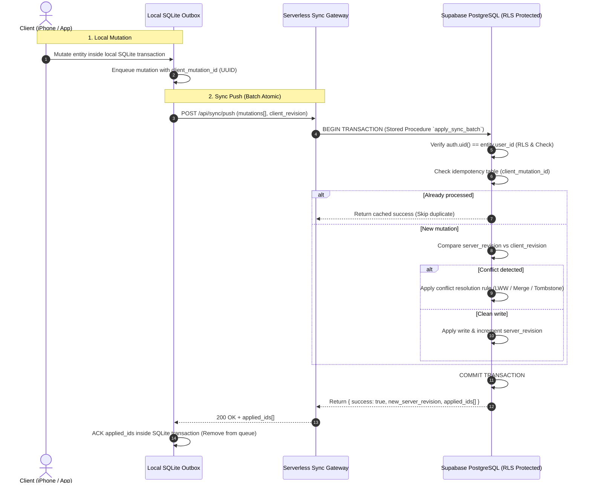

# S4 Sync Engine Preparation — Cloud Atomicity & Conflict Resolution

**Status:** `PREPARED` / `ASTRA_REQUIRED`  
**Author:** Gemini (Preparation for Astra)  
**Risk Level:** `CRITICAL` / P0  
**Scope:** Server-side atomic writes, idempotency, revision vectors, conflict handling, multi-device synchronization, and tombstones.

> [!IMPORTANT]
> **Trust Boundary & Governance**
> Client writes and remote payloads are untrusted. The client never dictates arbitrary server timestamps or ownership.
> Architectural decisions on revision handling and atomic cloud transactions require Astra review (`ASTRA_REQUIRED`).
> No irreversible migrations or production schema alterations are performed in this block.

---

## 1. Current State Inventory

EVARO's local sync stack currently consists of:
- **Local SQLite v2 Store:** Document + normalized tables, versioned schema migrations (`normalizedState.ts`, `storage.ts`).
- **Durable FIFO Outbox:** Queue table in SQLite with local transaction rollback protection (`3bd4713`).
- **Client Pull Validation:** Validates incoming payloads against Zod schemas and foreign key integrity before local write (`51561d0`).
- **Current Limitation:** Cloud sync operates via individual REST requests (up to 6 discrete endpoints). If endpoint 3 fails, endpoints 1 and 2 remain written in the cloud, creating partial state divergence.

---

## 2. Data Flow Architecture



---

## 3. Failure & Conflict Scenarios Matrix

| Scenario | Trigger / Precondition | Risk | Required Behavior | Astra Decision (`ASTRA_REQUIRED`) |
|---|---|---|---|---|
| **Partial Cloud Failure** | Network drop after 2 of 5 entity writes | Split-brain state | Cloud batch must be single atomic transaction (`apply_sync_batch` RPC) | Stored procedure transaction boundary vs. Edge Function transaction |
| **Duplicate Mutation / Retry** | Client pushes, server succeeds, ACK drops on network | Duplicate workout / double volume | Server idempotency table recording `client_mutation_id` for 30 days | Idempotency storage retention & cleanup schedule |
| **Simultaneous Multi-Device Edit** | User edits workout on iPhone while iPad syncs | Stale overwrite | Revision counter (`entity_version`) check; reject or merge field-level diff | Last-Write-Wins (LWW) with vector clock vs. 3-way merge |
| **Entity Deletion (Tombstone)** | Device A deletes workout while Device B is offline | Resurrection of deleted data | Soft-delete column `deleted_at` (Tombstone) propagated during pull | Tombstone garbage collection interval (e.g. 90 days) |
| **Account Switch on Device** | User logs out, User B logs in on same device | Data leak across users | SQLite queue scoped strictly by `user_id`; purge unauthenticated items | Partitioned SQLite file vs. strict tenant scoping |
| **Clock Skew / Hostile Client Clock** | Device clock is set 5 years into the future | Corrupts sorting and LWW | Server timestamp `now()` authoritative; client timestamp advisory only | Server clock enforcement on updated_at |

---

## 4. Test Fixtures & Mock Backend Contracts

### Fixture A: Atomic Push Request Payload
```json
{
  "client_id": "99999999-9999-4999-8999-999999999999",
  "client_mutation_id": "aaaaaaaa-bbbb-4ccc-8ddd-eeeeeeeeeeee",
  "base_revision": 42,
  "mutations": [
    {
      "entity": "workout_sessions",
      "action": "upsert",
      "id": "11111111-2222-4333-8444-555555555555",
      "data": {
        "name": "Heavy Bench Day",
        "started_at": "2026-09-21T10:00:00.000Z",
        "completed_at": "2026-09-21T11:00:00.000Z",
        "duration_seconds": 3600
      }
    },
    {
      "entity": "session_exercises",
      "action": "upsert",
      "id": "22222222-3333-4444-8555-666666666666",
      "data": {
        "session_id": "11111111-2222-4333-8444-555555555555",
        "exercise_id": "catalog-bench-press",
        "order": 0
      }
    }
  ]
}
```

### Fixture B: Conflict Response Payload (409 Conflict)
```json
{
  "error": "conflict",
  "conflict_type": "revision_mismatch",
  "client_revision": 42,
  "server_revision": 45,
  "conflicting_entities": [
    {
      "entity": "workout_sessions",
      "id": "11111111-2222-4333-8444-555555555555",
      "server_version": {
        "name": "Heavy Bench Day (Edited on iPad)",
        "updated_at": "2026-09-21T10:45:00.000Z"
      }
    }
  ]
}
```

---

## 5. Scope Handover to Astra

- [ ] Astra to review SQL RPC transaction specification for Supabase.
- [ ] Astra to confirm conflict resolution policy (Entity LWW vs Field-Level merge).
- [ ] Astra to review tombstone retention duration.
