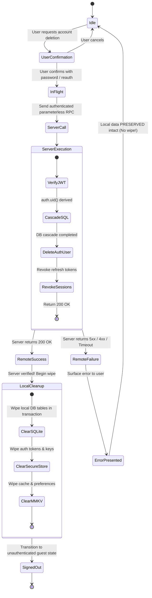

# S5 Account Deletion & Privacy Governance Specification

**Status:** `PREPARED` / `ASTRA_REQUIRED`  
**Author:** Gemini (Preparation for Astra)  
**Risk Level:** `CRITICAL` / P0  
**Scope:** GDPR Art. 17 / Apple Guideline 5.1.1(v) Account Deletion, complete data cascade, session revocation, local wipe sequence.

> [!CAUTION]
> **Strict Security & Privacy Invariant**
> The client must NEVER specify the target user ID to delete. The server derives user identity exclusively from the authenticated JWT session (`auth.uid()`).
> Local data must NEVER be wiped before the server has returned an explicit HTTP 200 / success confirmation.
> Fake-success UI or silent swallow of network deletion errors is strictly forbidden by EVARO Security Guardrails.
> Production PostgreSQL migration and RPC activation is marked `ASTRA_REQUIRED`.

---

## 1. Deletion Lifecycle State Machine



---

## 2. Server-Side Contract: `delete_user_account()` RPC

### PostgreSQL Function Specification (Draft for Astra Review)

```sql
-- DRAFT: To be reviewed and migrated by Astra on Supabase Staging/Production
CREATE OR REPLACE FUNCTION public.delete_user_account()
RETURNS jsonb
LANGUAGE plpgsql
SECURITY DEFINER
SET search_path = public, auth, pg_temp
AS $$
DECLARE
    v_user_id uuid;
    v_deleted_workouts int;
    v_deleted_measurements int;
BEGIN
    -- 1. Derive identity strictly from trusted session token
    v_user_id := auth.uid();
    IF v_user_id IS NULL THEN
        RAISE EXCEPTION 'Authentication required: no active session found'
            USING ERRCODE = '28000';
    END IF;

    -- 2. Delete user-owned domain records in dependency order
    DELETE FROM public.session_exercise_sets
    WHERE session_exercise_id IN (
        SELECT se.id FROM public.session_exercises se
        JOIN public.workout_sessions ws ON ws.id = se.session_id
        WHERE ws.user_id = v_user_id
    );

    DELETE FROM public.session_exercises
    WHERE session_id IN (
        SELECT id FROM public.workout_sessions WHERE user_id = v_user_id
    );

    DELETE FROM public.workout_sessions WHERE user_id = v_user_id;
    GET DIAGNOSTICS v_deleted_workouts = ROW_COUNT;

    DELETE FROM public.body_measurements WHERE user_id = v_user_id;
    GET DIAGNOSTICS v_deleted_measurements = ROW_COUNT;

    DELETE FROM public.custom_exercises WHERE user_id = v_user_id;
    DELETE FROM public.workout_templates WHERE user_id = v_user_id;
    DELETE FROM public.training_plans WHERE user_id = v_user_id;
    DELETE FROM public.user_profiles WHERE user_id = v_user_id;
    DELETE FROM public.sync_outbox WHERE user_id = v_user_id;

    -- 3. Delete from auth.users (requires security definer permissions)
    DELETE FROM auth.users WHERE id = v_user_id;

    RETURN jsonb_build_object(
        'success', true,
        'user_id', v_user_id,
        'deleted_at', now(),
        'records_purged', jsonb_build_object(
            'workouts', v_deleted_workouts,
            'measurements', v_deleted_measurements
        )
    );
EXCEPTION
    WHEN OTHERS THEN
        -- Re-raise with sanitized error; never leak database internals
        RAISE EXCEPTION 'Account deletion failed: %', SQLERRM;
END;
$$;
```

---

## 3. Client Failure & Safety Contract

| Condition | Client Action | Local State | UI Presentation |
|---|---|---|---|
| **Network Error / Offline** | Abort request | 100% Intact. No tables dropped. No token purged. | „Netzwerkfehler: Dein Konto konnte nicht gelöscht werden. Bitte überprüfe deine Internetverbindung und versuche es erneut.“ |
| **Server 500 / 503** | Abort request | 100% Intact. No tables dropped. | „Serverfehler: Bitte versuche es später erneut oder kontaktiere den Support.“ |
| **Expired Session / 401** | Prompt re-authentication | 100% Intact. | „Sitzung abgelaufen: Bitte melde dich erneut an, um dein Konto zu löschen.“ |
| **Server 200 OK** | Execute local wipe sequence | SQLite tables emptied, SecureStore tokens purged, MMKV reset | „Dein Konto und alle Daten wurden erfolgreich und unwiderruflich gelöscht.“ |

---

## 4. Scope Handover to Astra

- [ ] Astra to review SQL RPC permissions (`SECURITY DEFINER` vs Supabase Management API).
- [ ] Astra to verify Auth deletion trigger cascades on foreign keys in Supabase environment.
- [ ] Astra to test actual rollback behavior in PostgreSQL staging container.
