# Data Model

The fitness tracker's domain model. The TypeScript source of truth lives in
[packages/domain/src/types/index.ts](../packages/domain/src/types/index.ts),
with runtime validators in
[packages/domain/src/schemas/index.ts](../packages/domain/src/schemas/index.ts)
and the PostgreSQL/Supabase realisation in [schema.sql](./schema.sql).

## Overview

- **User** owns everything. Every other entity (except shared library
  exercises) is scoped to a `userId`.
- **Exercise** is either a shared library movement (`ownerId` null) or a custom
  one authored by a user.
- **Program → WorkoutTemplate → Session** form the planning-to-execution
  pipeline:
  - A **Program** schedules **WorkoutTemplate**s across weeks/days
    (`ProgramWorkout`).
  - A **WorkoutTemplate** prescribes exercises and targets
    (`TemplateExercise`).
  - A **WorkoutSession** is the _performed_ record, containing
    `SessionExercise`s, each with logged `ExerciseSet`s.
- **PersonalRecord** and **BodyMetric** are independent progress-tracking
  records owned by the user.
- **ActiveWorkoutState** is ephemeral client state (Zustand + MMKV); it is not
  persisted server-side and instead materialises into a `WorkoutSession` on
  finish.

## ER Diagram

```mermaid
erDiagram
    USER ||--o{ EXERCISE : "authors (custom)"
    USER ||--o{ WORKOUT_TEMPLATE : owns
    USER ||--o{ PROGRAM : owns
    USER ||--o{ WORKOUT_SESSION : owns
    USER ||--o{ PERSONAL_RECORD : owns
    USER ||--o{ BODY_METRIC : owns

    PROGRAM ||--o{ PROGRAM_WORKOUT : schedules
    PROGRAM_WORKOUT }o--|| WORKOUT_TEMPLATE : references

    WORKOUT_TEMPLATE ||--o{ TEMPLATE_EXERCISE : contains
    TEMPLATE_EXERCISE }o--|| EXERCISE : references

    WORKOUT_SESSION }o--o| WORKOUT_TEMPLATE : "started from"
    WORKOUT_SESSION }o--o| PROGRAM : "scheduled by"
    WORKOUT_SESSION ||--o{ SESSION_EXERCISE : contains
    SESSION_EXERCISE }o--|| EXERCISE : references
    SESSION_EXERCISE ||--o{ EXERCISE_SET : logs

    PERSONAL_RECORD }o--|| EXERCISE : "for"
    PERSONAL_RECORD }o--o| WORKOUT_SESSION : "set during"
    PERSONAL_RECORD }o--o| EXERCISE_SET : "achieved by"

    USER {
        uuid id PK
        text email UK
        text display_name
        text avatar_url
        date date_of_birth
        biological_sex biological_sex
        numeric height_cm
        unit_system preferred_units
        fitness_goal fitness_goal
        experience_level experience_level
        timestamptz created_at
        timestamptz updated_at
    }

    EXERCISE {
        uuid id PK
        text name
        text instructions
        muscle_group[] primary_muscles
        muscle_group[] secondary_muscles
        equipment equipment
        movement_pattern movement_pattern
        boolean is_custom
        uuid owner_id FK "null = shared library"
        boolean is_unilateral
        timestamptz created_at
        timestamptz updated_at
    }

    WORKOUT_TEMPLATE {
        uuid id PK
        uuid user_id FK
        text name
        text description
        integer estimated_duration_minutes
        boolean is_archived
        timestamptz created_at
        timestamptz updated_at
    }

    TEMPLATE_EXERCISE {
        uuid id PK
        uuid template_id FK
        uuid exercise_id FK
        integer order
        integer target_sets
        integer target_reps
        integer target_reps_max
        numeric target_weight
        numeric target_rpe
        integer target_rir
        integer target_rest_seconds
        text superset_group
        text notes
    }

    PROGRAM {
        uuid id PK
        uuid user_id FK
        text name
        text description
        integer duration_weeks
        fitness_goal goal
        boolean is_active
        timestamptz started_at
        timestamptz created_at
        timestamptz updated_at
    }

    PROGRAM_WORKOUT {
        uuid id PK
        uuid program_id FK
        uuid template_id FK
        integer week
        integer day_of_week
        integer order
    }

    WORKOUT_SESSION {
        uuid id PK
        uuid user_id FK
        uuid template_id FK
        uuid program_id FK
        text name
        timestamptz started_at
        timestamptz completed_at
        integer duration_seconds
        numeric bodyweight_kg
        numeric perceived_exertion
        text notes
        timestamptz created_at
        timestamptz updated_at
    }

    SESSION_EXERCISE {
        uuid id PK
        uuid session_id FK
        uuid exercise_id FK
        integer order
        text superset_group
        text notes
    }

    EXERCISE_SET {
        uuid id PK
        uuid session_exercise_id FK
        integer set_number
        set_type type
        numeric weight
        integer reps
        numeric rpe
        integer rir
        integer rest_seconds
        numeric duration_seconds
        numeric distance_meters
        text notes
        boolean completed
        timestamptz completed_at
    }

    PERSONAL_RECORD {
        uuid id PK
        uuid user_id FK
        uuid exercise_id FK
        personal_record_type type
        numeric value
        integer reps
        uuid session_id FK
        uuid set_id FK
        numeric previous_value
        timestamptz achieved_at
    }

    BODY_METRIC {
        uuid id PK
        uuid user_id FK
        timestamptz recorded_at
        numeric weight_kg
        numeric body_fat_percentage
        integer resting_heart_rate
        jsonb measurements
        text notes
        timestamptz created_at
    }
```

## Notes on cardinality

- `WORKOUT_SESSION → WORKOUT_TEMPLATE` and `→ PROGRAM` are optional
  (`}o--o|`): an ad-hoc session need not come from a template or program. The
  FKs are `ON DELETE SET NULL` so deleting a template/program preserves history.
- `TEMPLATE_EXERCISE → EXERCISE` and `SESSION_EXERCISE → EXERCISE` use
  `ON DELETE RESTRICT`: an exercise referenced by plans or history cannot be
  hard-deleted.
- A user may have **at most one active program** (enforced by a partial unique
  index in `schema.sql`).
