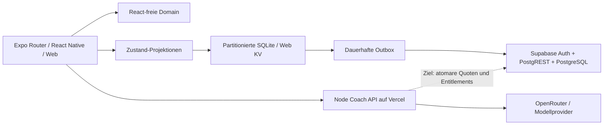

# Architektur, Datenbank und Backend

Codebasis: `39b2b3e`, mit dem lokalen Kontolösch-Hardening dieses Checkpoints. Ziel ist ein modularer Monolith im bestehenden pnpm-Monorepo, keine getrennten Frontend-/Backend-Repositories.

## Codekarte

| Pfad | Verantwortung |
| --- | --- |
| `apps/mobile/app/` | Expo-Router-Screens, Navigation und composition; keine eigene zweite Domainlogik |
| `apps/mobile/src/components/` | Gemeinsame Editor-, Anatomie-, Dialog-, Picker- und Dashboard-Bausteine |
| `apps/mobile/src/stores/` | Zustand-Projektionen, Kontoübergänge, persistente Befehle, Sync-Worker |
| `apps/mobile/src/data/` | Native/Web-Datenbankadapter, SQLite-Dokumente und normalisierte Aggregate |
| `apps/mobile/src/services/`, `src/utils/` | Auth-/Entitlement-/Export-/Delete-/Coach-/Telemetry-Verträge und Adapter |
| `packages/domain/src/` | Typen/Zod, Workout-/Kalender-/Muskel-/XP-/Entitlement-Regeln; ohne React/Expo |
| `packages/ui/src/` | Gemeinsame Tokens, Themes und UI-Primitives; keine Backendautorität |
| `api/` | Node/Vercel Coach- und Beta-Session-Handler, Provideradapter, Safety/Schema/Timeout |
| `supabase/migrations/` | Versionierte Cloud-Migrationen; derzeit Ownership-Migration `202609190001` |
| `docs/schema.sql`, `docs/release/rls_negative_tests.sql` | Ausführbare Cloud-Baseline und negativer SQL-Harness, keine Produktionsfreigabe |
| `scripts/security/`, `.github/workflows/ci.yml` | Dependency/Secret/RLS-Gates und CI |

## Lokale Wahrheit

Native: Expo SDK 54, React Native 0.81.5, `training.sqlite`, Schema 2, WAL, `synchronous=FULL`, Foreign Keys und gebundene Werte. Zustand ist UI-Projektion, kein zweiter Datenbestand. Kleinere Stores liegen als validierte JSON-Dokumente vor; große Trainingsaggregate sind in geordneten Session-/Übungs-/Satzzeilen normalisiert.

| Tabelle | Zweck |
| --- | --- |
| `state_documents` | Partitionierte Metadaten und kleinere Store-Dokumente |
| `legacy_imports`, `normalization_backups` | Originalbytes, Importmarker und Migrationssicherung |
| `workout_sessions`, `session_exercises`, `exercise_sets` | Aktive, abgeschlossene und letzte Workout-Snapshots; zusammengesetzte Fremdschlüssel |
| `sync_operations` | Dauerhafte Queue, Payload und Retryzustand |

Workout-Finish und Coach-Plan-Speichern bündeln mehrere Store-Schreibvorgänge in nativen Transaktionen; Fehler setzen SQL und UI-Projektionen zurück. Differenzwrites erhalten unveränderte Zeilen. Nicht alle Befehle sind bereits übergreifend atomar. JS lädt weiterhin große Projektionen; Paging ist offen. Web-KV bietet keine gleichwertige Mehrfachstore-Transaktion.

Partitionen `account:<UUID>` und `legacy` isolieren lokale Daten. Accountwechsel serialisiert Hydration; Scope-Generationen entwerten alte Async-Ergebnisse auch bei A→B→A. **Aktueller Code importiert einen Guest-Snapshot nach Login** (`authStore.applyAccountSession` / `authMigration.ts`). Frühere Dokumente behaupteten fälschlich, dies sei abgeschaltet. Eigentümer-/Einwilligungsregeln und Doppelimport bei historischen gemischten Daten sind unter R02 zu prüfen; keine nachträgliche Eigentümerrateaktion.

Migrationen validieren zuerst, sichern ursprüngliche Bytes und committen Version/Marker erst nach Erfolg. Unbekannte Formate nicht still auf Defaults setzen. OS-Dateischutz/Backups und SQLite-/WAL-Datenreste sind getrennt zu prüfen; keine SQLCipher-Verschlüsselung behaupten. [SecureStore-Vertrag](../reference/SECURE_STORAGE.md) beschreibt Sessionmigration und sicheren Rollback.

## Cloud: Ist und nächster Vertrag

Aktuell spricht `syncStore.ts` direkt PostgREST an. Mehrstufiges Parent-Upsert/Child-Delete/Insert ist **nicht serverseitig atomar**. Lokale FIFO/Retry/Scope-Grenzen lösen keine Multi-Device-Konflikte; Zeitstempelmerge, vollständige Pulls, fehlende Tombstones/Revisionen und SQL-NULL/optional-DTO-Unterschiede bleiben Risiken. Baseline plus restriktive RLS-Migration wurden lokal getestet, nicht als deployed bestätigt. [RLS-Harness](../reference/RLS_TESTING.md).

Ziel vor Cloud-Freigabe: pro Workout-/Template-/Programm-Aggregat ein validiertes transaktionales RPC; Ownership aus verifizierter Session, stabile `operation_id`, eindeutige `(owner, operation)`-Idempotenz, Revision mit Compare-and-Swap und expliziter Konfliktantwort. Deletes erzeugen Tombstones; Cursor-Pulls und Retention verhindern Wiederauferstehung durch alte Offlinegeräte. Erst nach bestätigtem Cloud-Commit lokal ACKen. RPC-Grants, RLS, `search_path`, Referenzbesitzer und Response-Schema adversarial testen. Wiederholte Kosten-/Löschoperationen benötigen eigene dauerhafte Idempotenz.

Schemaänderungen expand/contract, synthetischer Preflight und isolierter Restore zuerst. Kein automatisches Löschen inkonsistenter Bestandsdaten. Katalogseeds/IDs und nullable DTOs mit echten PostgREST-Antworten abgleichen. Paging und notwendige Owner-/Revision-/Cursor-Indizes anhand Queryplänen/Lastmessung ergänzen, keine prophylaktische Infrastrukturflut.

## Konto und Export

`dataExportService.ts` exportiert lokalen Bestand; kein cloudweiter Exportnachweis. Ziel: manifestierter Umfang/versionierter JSON-Export plus brauchbare Workout-/Messwert-CSV, alle kontobezogenen Quellen einschließlich Queue/aktueller Session/Settings/Cloud nach Dateninventar. Keine Tokens/Providersecrets exportieren.

Kontolöschung benötigt einen expliziten, versionierten Serverbeleg für den ursprünglichen Nutzer; ein leeres RPC-Ergebnis ist kein Erfolg. Client schützt aktuellen Scope, bereinigt höchstens einmal und meldet Teilfehler. Der Client erwartet exakt `{version:1, success:true, user_id:<ursprüngliche UUID>, deleted_at:<ISO8601>}`; unbekannte zusätzliche Felder oder Void werden abgelehnt. Das zugehörige Backend ist **noch nicht implementiert/deployt**. R01 umfasst Auth, Cloudzeilen, private Medien, Tokens/Sessions, Providerzuordnungen, Retention und Wiederholung. Reauth und serverseitige Autorität bleiben Pflicht; kein User-ID-Argument als Löschberechtigung.

## Coach und Berechtigungen

Coach überprüft Supabase-Identität oder explizit serverseitig signierte Beta-Sessions; lokaler Loopback-Modus ist ein eigener Entwicklungspfad. Bilinguale Safety, begrenzte Medien/Eingaben, Schemaausgaben, Abort/Timeout, begrenzter Retry, `COACH_ENABLED=false`, prozesslokale Rate-/Concurrency-Limits bestehen. Client 401/403 zählen nicht als Providercircuit-Ausfall. Modelle konfiguriert der Server; Schlüssel bleiben dort. Forschungssuche nutzt feste Begriffe ohne Profil-/Gesundheitsdaten.

Offen: verteiltes Quoten-/Usage-Ledger, globale und nutzerbezogene Budgets, serverseitige Bezahlrechte. Beta-Installations-IDs sind frei wählbar; wiederholtes Session-Minting ist kein belastbarer Missbrauchsschutz. OpenRouter-Guthaben/Betreiberbestätigung ersetzt keine atomare Nutzerquote.

Einfachste robuste nächste Lösung: vorhandenes PostgreSQL für atomare Reservierung je Request/Zeitraum nutzen, Completion/Release einer Reservierung idempotent, begrenzte TTL für abgebrochene Requests, globale Cap unabhängig von Geräteidentität. Text/Bild/Audio getrennt budgetieren; Speicherstörung vor Providerkosten fail-closed. Redis erst bei gemessenem Durchsatz-/Latenzbedarf, nicht als Voraussetzung erfinden.

`entitlementService` besitzt Providerinterface/Cache (24 h plus Ablaufprüfung), aber keinen produktiven Billing-Provider. Clientcache verbessert Offline-UX und vergibt keine Serverrechte. RevenueCat bleibt bevorzugter Kandidat über StoreKit/Play Billing, Beschaffung/Verträge/Integration offen. Rollen oder Pro nie aus veränderlichem `user_metadata` oder Requestbody ableiten.

## Betriebsadapter und Skalierung

Logging/Telemetry begrenzen und redigieren technische Metadaten. Ein lokaler Buffer/Interface beweist weder Remote-Monitoring noch wirksame Fernkonfiguration; Diagnostics-/RemoteConfig-Services sind nicht umfassend verdrahtet. Kein Session Replay für sensible Screens.

Ein EU-Projekt/Region, getrenntes Staging und kleine stateless API sind der Ausgangspunkt. DB-Connection-Limits/Pooler, Zeitbudgets/Mediengrößen, Backpressure, bounded retries und Kostenmetriken müssen messbar sein. Managed PostgreSQL/Vercel beibehalten, solange Last, Compliance und Kosten passen. Eine Migration braucht Benchmarks, Ausfall-/Datenübernahmeplan und überprüfbaren Vorteil.
